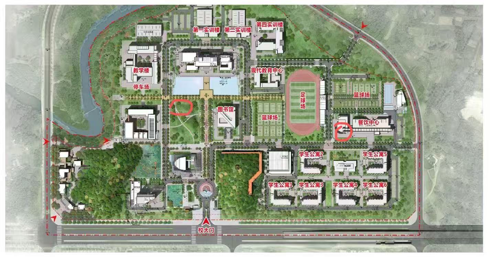

---
AIGC:
  ContentProducer: '001191110102MAD55U9H0F10002'
  ContentPropagator: '001191110102MAD55U9H0F10002'
  Label: '1'
  ProduceID: 'e366a4ed-03ea-4500-9bfd-fbcce90b8caf'
  PropagateID: 'e366a4ed-03ea-4500-9bfd-fbcce90b8caf'
  ReservedCode1: 'bead55e8-d781-4f8a-acf5-b82af7928e93'
  ReservedCode2: 'bead55e8-d781-4f8a-acf5-b82af7928e93'
---

# 内江职业技术学院新生指南知识库（全量升级版）

> 数据来源：学校官网 + 招生网 + 学工部 + 官方采购公告 + 用户确认
> 更新日期：2026-08-31
> 版本：v2.0（对标 cduestc-guide 全量标准，24章全覆盖）

---

## 一、你好，新同学

### 学校简介

内江职业技术学院是四川省人民政府批准，内江市人民政府举办的市属综合类高职院校。办学理念："以德立人，以职立教，以特立校"；办学精神："自强博爱，严谨勤勉，合作共进"；校训：**"厚德、精业、行健、致远"**。

【历史沿革】前身可追溯至1956年，2003年由原内江财贸校、内江工业学校、内江农业学校、内江水电学校和轻化工技校等5所重点中专学校合并组建为公办全日制普通高职院校。

【院系设置】8个二级学院：
1. **智能装备与汽车技术学院**：机械制造及自动化、智能制造装备技术、汽车制造与试验技术、新能源汽车技术、智能网联汽车技术、机电一体化技术、工业机器人技术
2. **现代农业与生物技术学院**：现代农业技术、园林技术、畜牧兽医、动物医学、食品检验检测技术
3. **人工智能与数字技术学院**：计算机应用技术、云计算技术应用、物联网应用技术、应用电子技术、集成电路技术
4. **数字商贸与物流技术学院**：大数据与会计、大数据与财务管理、大数据与审计、电子商务、网络营销与直播电商、现代物流管理、市场营销
5. **智能建造与工程技术学院**：建筑工程技术、道路与桥梁工程技术、铁道工程技术、水利水电建筑工程、建设工程管理
6. **文化旅游与创意设计学院**：酒店管理与数字化运营、烹饪工艺与营养、数字媒体艺术设计、服装设计与工艺、现代文秘
7. **通识教育与公共服务学院**：婴幼儿托育服务与管理、智慧健康养老服务与管理
8. **马克思主义学院**：负责全校思想政治理论课教学

【办学规模】总占地面积864亩，规划建筑面积26.7万㎡。全日制在校生11108人，在编教职工543人。固定资产总额8.38亿元，教学仪器设备总值1.08亿元。校内实训室105个，校外实训基地126个。

【荣誉】四川省示范高职院校、四川省"双高计划"培育建设学校、国家级高技能人才培训基地。

### 校区概况

单一校区办学，位于**内江市东兴区汉安大道东四段199号**，地处内江中心城区汉安大道东段、高新技术开发区境内。距成渝高铁内江北站仅4公里，约5分钟车程，最快约40分钟可直达成都、重庆。

现校区已建成宿舍楼6栋，分别以**甜园1-6栋**命名，宿舍为6人间，提供公共洗衣房。学校正在建设新校区产教融合建设项目。

### 重要电话与网址

- 院办：**0832-2262348**
- 招生办：**0832-2265927 / 2261439**
- 成教：**0832-2101395**
- 学校官网：**https://www.njvtc.edu.cn**
- 招生网：**http://zs.njvtc.edu.cn**
- 教务网：**http://jwc.njvtc.edu.cn**
- 图书馆：**http://lib.njvtc.edu.cn**
- 就业网：**http://jy.njvtc.edu.cn**
- 校历查询：**https://www.njvtc.edu.cn/index/xxfw/nzxl.htm**
- 学工部（学生资助）：**http://xsc.njvtc.edu.cn**

**校址**：内江市东兴区汉安大道东段199号，邮编641000

---

## 二、录取通知书查询

### 一、发放时间

录取通知书一般在**八月中旬**陆续寄出，具体以学校招生网通知为准。请同学们耐心等待，关注学校官方通知。

### 二、微信小程序查询流程

微信搜索关注"EMS中国邮政速递物流"小程序，即可实时查询录取通知书的邮寄状态。

* **第一步**：打开微信搜索"EMS"并选择"EMS中国邮政速递物流"小程序。
* **第二步**：在首页中部，点击"高考录取通知书"宣传图进入专项查询页面。
* **第三步**：点击"考生邮件查询"服务，在输入框中输入您的考生号、准考证号或邮件号，点击查询即可查看当前物流状态。

### 三、录取结果查询

* **学校招生网查询**：登录 http://zs.njvtc.edu.cn ，进入"招生快讯"栏目查看录取公示
* **四川省教育考试院**：登录https://www.sceea.cn 查询录取结果
* **电话咨询**：拨打招生办 0832-2265927 / 2261439

### 四、通知书内含材料

录取通知书包裹一般包含以下材料，请仔细核对：
1. 录取通知书（原件）
2. 新生入学须知（重要！含报到时间、流程、缴费方式等）
3. 银行卡（用于缴纳学杂费）
4. 资助政策简介（助学金/助学贷款申请指南）
5. 高校家庭经济困难学生认定申请表
6. 应征入伍宣传单
7. 学校简介及校园地图等宣传资料

---

## 三、校园地图

### 全校鸟瞰图

### 主要建筑分布

| 楼栋名称 | 功能 | 位置说明 |
|---------|------|---------|
| **致远楼** | 行政办公 | 教务处（二楼）、学工部（一楼）、财务处均在此楼 |
| **思辛楼** | 生活服务综合体 | 一楼：校医院、校园网服务中心、便利店；二楼：理发店；三楼：打印店、理发店 |
| **求真楼** | 教学楼 | 分A栋、B栋等，日常上课及四六级考试考场 |
| **弘文楼** | 教学楼 | 新校区教学楼，心理健康教育中心511室设此 |
| **餐饮中心** | 食堂 | 一楼、二楼两层供学生就餐；二楼设有盛玛特超市 |
| **甜园1-6栋** | 学生公寓 | 6人间，公共洗衣房，分布在校园生活区 |
| **实训大楼** | 实验实训 | 105个校内实训室，9个生产性实训基地 |
| **体育馆/运动场** | 体育设施 | 标准田径场、篮球场、网球场等室外设施 |

### 教学区

* 建有公共教学大楼（求真楼）、实训大楼、教学工厂等教育教学场地
* 校内实训室105个，生产性实训基地9个
* 大学生创新创业服务中心
* 标准田径运动场、篮球场、网球场

### 生活区

* 宿舍楼群（甜园1-6栋）分布于校园生活区，具体位置可参考校园鸟瞰图
* 餐饮中心（思辛楼）位于校园中心区域
* 菜鸟驿站位于公寓5栋与2栋中间区域

### 运动区

* 标准田径运动场（开放时间：6:00-22:00）
* 篮球场、网球场（开放时间：6:00-22:00，体育课时间优先使用）
* 体育馆内设施含羽毛球、乒乓球、健身房等
* 校内无独立游泳池，如需游泳可前往万晟汇等周边商业游泳馆

### 行政区

* 教务处：致远楼二楼
* 学工部：致远楼一楼
* 财务处：致远楼
* 校医院：思辛楼一楼
* 校园网服务中心：思辛楼一楼

### 常用路线

* 从南门进入→直行约200米→到达甜园宿舍区
* 从南门进入→左转→到达致远楼（行政楼）
* 从南门进入→右转→到达餐饮中心（思辛楼）
* 从南门进入→直行→到达求真楼（教学楼）

---

## 四、报到全流程

### 报到前准备

**证件材料清单（务必带齐！）**：
1. 录取通知书（原件）
2. 身份证及正反面复印件（建议各备5份以上）
3. 户口本复印件（户主页+本人页）
4. 近期一寸/两寸证件照（建议各备8-12张，蓝底/白底）
5. 个人档案（如需自带，**不得拆封**）
6. 党团组织关系转接材料
7. 户口迁移证（如需迁户口，自愿原则）
8. 贫困证明材料（如需申请助学金/绿色通道：建卡贫困户证、低保证等）
9. 银行卡（学校随通知书寄发的卡，用于缴费）
10. 现金少量（备用，建议200-500元）

> 以上为通用清单，具体以录取通知书内《新生入学须知》为准。

### 线上预报到与缴费

* 学校通过**"智慧内职"APP**进行线上预报到和新生信息采集
* 缴费通过**智慧内职APP**（搜索"学费缴纳"，支持微信支付）或**校园缴费平台**（http://njvtcxssfglxt.service.njvtc.cn/u8pay/index.jsp，用户名学号，初始密码身份证号后8位）
* 缴费系统通常在**8月1日左右**开放，具体以录取通知书内通知为准
* 电子票据：微信"电子票夹"小程序查看

### 报到当天路线

* **学校地址**：内江市东兴区汉安大道东段199号
* **内江北站（高铁站）**：学院安排迎新志愿者和接驳车辆，路程约十分钟；也可乘坐高铁北站-内江职院微公交专线（约15分钟）
* **自驾**：导航搜索"内江职业技术学院"，从南门进入；报到期间家长车辆可临时入校，服从保卫处指挥
* 到达学院后会有志愿者引导到报到点位，进入线下报到流程

### 报到手续清单

1. 到各二级学院报到点注册签到、提交材料（录取通知书、身份证、档案等）
2. 领取新生入学资料袋（含校园内网激活指南、宿舍钥匙、校园内网安全使用承诺书等）
3. 缴纳学费/住宿费（如未线上缴费，可现场通过智慧内职APP缴纳）
4. 办理保险参保（学平险建议购买）
5. 办理宿舍入住手续（到甜园公寓楼下领取钥匙、填写入住登记表）
6. 领取军训服装（学校统一配发，详见第八章）
7. 学生证拍照/领取（部分需后续领取）

### 绿色通道与助学贷款

* **绿色通道**：家庭经济困难学生可在报到时通过"绿色通道"先办理入学手续，缓缴学费。需提前准备贫困证明材料（建卡贫困户证、低保证等），到校后在学生处/资助中心办理。联系电话：0832-2269063 / 2261729
* **生源地助学贷款**：在户籍所在地学生资助管理中心办理，每年最高可贷20000元（2025年最新额度）；校园地助学贷款到校后向学校资助中心申请（中国农业银行承办）

### 户口迁移与医保参保

* **户口迁移**：自愿原则，凭录取通知书到户籍所在地派出所办理《户口迁移证》，到校后交由学校保卫处统一办理落户
* **医保参保**：大学生城乡居民医保由学校统一组织参保，缴费标准以每年四川省/内江市医保政策为准（2026年度为400元/人），入学后由辅导员统一组织办理

---

## 五、开学预备物品清单

### 一、证件与资料（最重要！出发前必须检查！）

* 1. 录取通知书（原件）
* 2. 身份证（原件+正反面复印件5份以上）
* 3. 户口本复印件（户主页+本人页）
* 4. 个人档案（**不得拆封**）
* 5. 团员档案、团员证（如适用）
* 6. 党团组织关系转接材料
* 7. 一寸两寸照片各8-12张（蓝底/白底）
* 8. 银行卡（学校随通知书寄发的卡）
* 9. 贫困证明材料（如需申请助学金/绿色通道）
* 10. 生源地助学贷款回执（如已办理贷款）

### 二、军训用品

* 服装：学校统一配发陆军军训服（长袖迷彩服上衣1件、迷彩长裤1条）、解放鞋1双、军帽1顶、腰带（内外各一条），无需自行购买
* 自备：防晒霜（SPF50+防水防汗型，建议备2瓶）、舒适鞋垫（软弹防痛型）、透气内搭T恤、腰带
* 药品：藿香正气水/胶囊、驱蚊水、创可贴、碘伏棉签、润喉糖、个人常用药品
* 生活：大容量水杯（1L左右）、纸巾湿巾、晒后修复产品

### 三、生活用品

* 1. 床上用品：床垫（0.9m×1.9m标准）、被套、被子、枕头、床单、床帘（建议开学后再买床帘，太大件不利于前期与室友建立关系）
* 2. 衣物：夏秋衣物、内衣内裤、袜子、鞋子（含拖鞋）；外地同学冬天建议直接网购，薄外套备一件
* 3. 洗漱用品：洗衣液、沐浴露、洗发水、牙膏牙刷漱口杯、洗脸巾、浴巾
* 4. 电器：插线板（很重要！）、充电宝（3C认证）、充电头充电线、蓝牙耳机、吹风机（1500W以下）
* 5. 文具：笔、纸、笔记本、书包
* 6. 清洁工具（室友一起AA购买）：扫把、拖把、撮箕、垃圾桶、垃圾袋、晾衣杆、洁厕灵、马桶刷

### 四、电子产品

* 电脑（以专业而定，详见第二十三章电脑选购指南）
* 鼠标、鼠标垫、电脑充电器
* 台灯（充电式或插电式）
* U盘（建议16G以上）

### 五、学长建议

> 如果带不下，第3、4、6条的生活用品和清洁工具都可以到校后现买！床上用品建议网上选好、开学前下单到学校菜鸟驿站。证件资料第1-10条开学前就必须准备好！外地的同学冬天衣服建议直接网购。路由器网线自行准备（宿舍外网为电信宽带，无线网络）。

---

## 六、宿舍生活

### 宿舍类型与分配规则

* **宿舍楼**：甜园1-6栋，已全部建设完成
* **房间类型**：6人间
* **床铺尺寸**：0.9m×1.9m标准宿舍床
* **分配规则**：按照二级学院-班级的大类，按照先到先得的规则随机分配，学院分布较集中
* **空调**：已全部安装（2026年新增采购空调，全覆盖）

### 宿舍设施一览

| 设施项目 | 详情 |
|---------|------|
| 床铺尺寸 | 0.9m × 1.9m（标准宿舍床） |
| 床型 | 上床下桌或上下铺（以实际分配为准） |
| 空调 | 已全部安装 |
| 热水 | 集中供应热水，宿舍内扫码使用（"趣智慧校园"APP） |
| 洗衣机 | 甜园宿舍区公共洗衣房（新建楼栋每层皆有公共洗衣房） |
| 网络 | 校园内网免费开通；宿舍外网为电信宽带ChinaNet-EDU |
| 独立卫浴 | 以实际楼栋为准，部分为公共卫浴 |

### 宿舍供电与限电规定

* **供电时间**：每日 06:30 - 23:30（周五周六夜间、法定节假日、期末复习考试周可能延长供电）
* **限电规定**：禁止使用大功率电器（电炉、热得快、电磁炉、微波炉、电饭煲、卷发器等发热电器），违规使用将触发跳闸并没收电器
* **电动车电池**：严禁带入宿舍楼内充电

### 宿舍作息与门禁

* **归寝时间**：日常行课期间 **22:30**；节假日 **23:00**；周日查寝 **20:30前**
* **熄灯时间**：每晚 **23:00**，熄灯后不高声喧哗
* **门禁方式**：人脸识别/校园卡刷卡进出
* **晚归处理**：需证件登记说明原因，警告处分；多次晚归可能被通报
* **来访登记**：外来人员须持有效证件登记，22:00后不得进楼或留宿；男性访客不得进入女生宿舍；男女禁互串宿舍楼

### 水电费充值

* **水电费**：通过**智慧内职APP**线上充值
* 每月有免费额度，超出部分自行充值
* **洗澡热水**：使用"趣智慧校园"APP扫码链接浴室，个人充值使用（50元起充）
* **空调电费**：由寝室室友自行协商充值，建议开学商量好26℃省电模式

### 宿舍报修

* 通过宿舍管理员/楼管报修
* 部分可通过智慧内职APP线上报修

---

## 七、吃喝在校

### 食堂分布与特色

* 学校有**一个食堂**（餐饮中心），位于**思辛楼**，一楼、二楼两层可供学生就餐
* 人均价格**10-15元/餐**
* 支持微信/支付宝扫码支付

### 食堂营业时间

| 餐次 | 营业时间 |
|------|---------|
| 早餐 | 7:00 - 9:00 |
| 午餐 | 11:00 - 13:00 |
| 晚餐 | 17:00 - 19:00 |

### 校内其他餐饮

* **蜜雪冰城**（校内3号门面）
* **库迪咖啡**
* **象客咖啡**
* **校内便利店**一家（位于思辛楼一楼，营业时间8:00-22:00）
* **盛玛特超市**（餐饮中心二楼，校内购物主要场所）

### 外卖

* 外卖通过美团/饿了么下单
* 取餐点一般在校门口指定区域或外卖柜
* 部分商家可送至宿舍楼下（商家对接派送，不通过平台）

### 周边美食

* 学校周边步行可达**万晟汇购物中心**（距离1.2公里），商业成熟
* 南门左边有商贩聚集营业（职院夜市，约1500㎡，100余个摊位）

---

## 八、生活设施与营业时间

### 澡堂/浴室

* 宿舍内集中供应热水，扫码使用（**"趣智慧校园"APP**扫码链接浴室）
* 个人使用需在APP上充值（50元起充）

### 开水房

* 宿舍区设有开水供应点，扫码使用
* 具体位置以校园实际分布为准

### 洗衣房

* 甜园宿舍区公共洗衣房
* 新建楼栋每层皆有公共洗衣房
* 使用方式：微信或美的小程序【U净】扫码启动

### 打印复印

* 校内思辛楼三楼设有打印店
* 价格一般 0.1-0.5元/页

### 快递收发

* **菜鸟驿站**：位于公寓5栋与2栋中间区域
* **快递地址**：四川省内江市东兴区高桥街道汉安大道东段199号内江职业技术学院
* **取件方式**：大部分使用【菜鸟】APP的出库码和身份码
* **超时规定**：大部分驿站5天未取会自动出库或退回，请及时取件！
* **营业时间**：约 9:00 - 19:00
* **代取服务**：可到学院QQ频道【跑腿代办】栏目发求助贴（有偿）

### 理发店

* 思辛楼二楼与三楼皆有理发店（二楼一家、三楼两家）
* 人均价格25-50元

### 超市与便利店

* **校内便利店**：思辛楼一楼，营业时间8:00-22:00
* **盛玛特超市**：餐饮中心二楼（规模较大，校内购物主要场所）
* **薪旺超市**：距学校约800米
* **红旗超市**：距约1.5公里

### 银行ATM

* 校园内暂无独立ATM网点，最近的ATM在校外周边银行网点
* 缴费主要通过智慧内职APP线上完成

### 通讯营业厅

* **宿舍外网**（宿舍宽带、ChinaNet-EDU）
* 运营商：中国电信（公开招标确定的宿舍外网服务商）
* 办理网点：思辛楼一楼校园网服务中心
* WiFi名称：**ChinaNet-EDU**
* 主要受理电信校园卡业务，套餐29元（流量套餐）和49元（校园宽带500M套餐）等
* 2026年7-8月迎新期间曾推出39元宽带优惠套餐

---

## 九、运动与休闲

### 田径场/操场

* 标准田径运动场，开放时间：6:00 - 22:00
* 夜间有灯光照明

### 球场

* 篮球场、网球场，开放时间：6:00 - 22:00
* 体育课时间优先使用，课余时间自由使用
* 无需预约，先到先得

### 体育馆

* 校内体育场地主要为**室外**场地，包含羽毛球、乒乓球、足球、篮球、排球等
* 开放时间：6:00 - 22:00
* 体育馆室内设施含羽毛球、乒乓球、健身房等

### 游泳池

* 校内无独立游泳池
* 如需游泳可前往万晟汇等周边商业游泳馆

### 社团活动中心

* 学生活动中心位于晨曦食堂/餐饮中心楼上区域
* 各社团活动场地由社团联合会统一调配

### 校园周边娱乐

* **UME影城（万晟城LUXE店）**：位于万晟汇购物中心4楼，7个全数字化激光放映厅，含LUXE巨幕厅，电话(0832)2073666
* **乐享KTV**：位于万晟汇购物中心内部
* **solo电玩游戏社**（PS4/PS5/NS主机游戏，万晟城店）
* 购物中心4楼有屋顶乐园
* 商场内有"劲浪体育"，涵盖健身房、篮球场等运动业态

---

## 十、军训攻略

### 军训时间安排

| 事项 | 时间 |
|------|------|
| 新生报到 | 9月11-12日 |
| 新生入学教育 | 9月14日 |
| 新生正式上课 | 9月20日 |
| 中秋放假 | 9月25-27日 |
| 国庆放假 | 10月1-7日（10月10日上班调休） |
| **新生军训** | **10月10日 - 10月23日**（约14天） |

### 服装与物资准备

**学校统一配发（无需自行购买）**：
* 陆军军训服：长袖迷彩服上衣1件、迷彩长裤1条
* 解放鞋1双
* 军帽1顶
* 腰带（内外各一条）

**自备物品**：
* 防晒霜（SPF50+防水防汗型，建议备2瓶）
* 舒适鞋垫（软弹防痛型，站军姿更轻松）
* 透气内搭T恤（建议2-3件换洗）
* 腰带（备用）
* 药品：藿香正气水/胶囊、驱蚊水、创可贴、碘伏棉签、润喉糖、个人药品
* 生活用品：大容量水杯（1L左右）、纸巾湿巾、晒后修复产品

### 训练内容与作息

* **训练内容**：队列训练（立正稍息、停止间转法、齐步走、正步走等）、内务整理、军姿军歌拉歌、军事理论课、结营汇演
* **训练作息**：上午一般8:00开始，高温天气提前解散（10:30-11:30）；下午一般14:00开训；晚上18:30开训
* 高温预警不军训，下雨在室内躲避或回寝室

### 请假与免训

* **免训**：退役士兵（需退伍证）；严重疾病（需二级甲等以上医院诊断证明）
* **缓训**：短期伤病、手术恢复期等（需医院证明）
* **临时请假**：临时生病、突发急事（需正规医院诊断证明）
* **流程**：本人申请→提交证明→学院审核→学校审批
* 军训成绩与学分挂钩，出勤影响最终成绩

### 军训汇演与评优

* 汇演在10月下旬（军训约14天后）
* 奖项：军训先进集体（优秀方阵）、优秀标兵（优秀学员）、优秀教官
* 评优标准：态度端正、出勤率高、纪律好、军事技能考核成绩优异
* 名额约参训人数10%（2025级3800多人评出295名优秀标兵）
* 汇演环节：分列式、军体拳、战术演练、教官表演等
* 流程："个人申请-教官推荐-民主评议-学院审批"

### 军训注意事项

* 1. 训练时手机统一收走，不要偷玩，否则会被惩罚；建议手机贴膜戴壳防磕碰
* 2. 做什么都要打报告，上厕所、身体不适都要报告教官
* 3. 中暑处理：立即报告教官，到阴凉处休息，补充淡盐水/藿香正气水
* 4. 磨脚应对：提前垫软鞋垫、贴创可贴
* 5. 发型要求：无强制要求，需整洁，女生扎发，男生短发为宜
* 6. 寝室内务不检查，不需要把被子叠成豆腐块
* 7. 晚上解散后是自由时间，可以出校门

### 与室友关系建立

* 军训期间寝室关系会迅速升温，大家从这时开始慢慢熟悉彼此
* 班级关系在军训期间逐渐建立，可交到其他专业或班级的朋友
* 军训期间有表演节目活动，可展示自己让大家认识你

---

## 十一、学习指南

### 选课流程

* **线下课程**（体育课、专业选修课）：登录教务系统 **http://172.18.2.19/default2.aspx**，账号为学号，初始密码通常为学号或身份证后6位；必须先完成评教才能选课
* **线上网络课**（公共任选课）：**超星尔雅**平台 njvtc.fanya.chaoxing.com，首次登录账号为学号，初始密码为 s654321s；手机端用"超星学习通"APP绑定学号选课
* **选课规则**："先选先得，选满即止"，建议提前准备备选方案
* 选课是必修环节，选课成功不上课成绩记0分

### 课表查询

* **电脑端**：教务系统官网 http://jwc.njvtc.edu.cn/，账号学号
* **数字校园门户（内网）**：http://172.18.2.82:8443/zfca/login，初始密码 abcd1234 或身份证后六位
* **手机端**："智慧内职"App首页有"课表查询"功能；微信企业号"内江职业技术学院"也可查询

### 图书馆

* **开馆时间**：周一至周日 **7:30-22:30**（国家法定节假日除外）；寒暑假闭馆
* **借阅规则**：学生限借5册，借期30天；教职工限借20册，借期180天；报刊资料内阅
* **查询**：智慧内职APP"我的图书借阅"服务
* **占座规定**：严禁占座，每日清场，禁带食品饮品
* 专升本复习专区在图书馆三楼左侧
* 图书馆电话：**0832-2560122**

### 自习室与空教室查询

* 主要通过"智慧内职"APP的"空闲教室"或"自习室查询"功能查询
* 其他自习场所：图书馆三楼"专升本复习专区"、部分女生公寓内自习室

### 教务系统

* 新教务系统：**http://172.18.2.19/**（选课、查成绩等核心操作）
* 老教务系统：http://172.18.2.42/web/web/web/index.asp
* 数字校园门户：http://ca.njvtc.edu.cn/zfca
* 账号：学号；初始密码：学号或身份证后6位
* 核心功能：网上选课、课表查询、成绩查询、考试报名、学籍管理
* 移动端："智慧内职"App整合课表、成绩、空闲教室、一卡通、图书借阅等功能

### 英语四六级

* **笔试**：6月、12月（2026年上半年为6月13日，四级9:00-11:20、六级15:00-17:25）
* **报名**：每年3月、9月（2026年上半年3月20日-4月2日），仅网上报名 http://cet-bm.neea.edu.cn
* **报名费用**：四级35元、六级37元
* **报考资格**：四级需大专学籍在校生；六级需四级425分及以上
* **考试地点**：校内（求真楼A栋等，以准考证为准）；听力调频96.00MHz
* **必带**：准考证、身份证/学生证、签字笔、2B铅笔、调频耳机及备用电池（考点无备用耳机）
* 严禁携带手机等电子设备入场

### 绩点计算

* **课程绩点** = (成绩-60)×0.1+1.0
  * 90-100分 → 4.0-5.0
  * 80-89分 → 3.0-3.9
  * 70-79分 → 2.0-2.9
  * 60-69分 → 1.0-1.9
  * 60以下 → 0
* **GPA** = ∑(课程绩点×课程学分) ÷ ∑课程学分
* 补考/重修通过按60分计算，绩点按1.0计算
* 专升本要求GPA排名在年级前40%

### 学业预警与退学红线

* **未经批准连续两周未参加教学活动** → 予以退学（依据《内江职业技术学院高职生学分制学籍管理实施细则》第八章第五十六条）
* 逾期两周不注册 → 自动退学
* 课程累计缺课达1/3 → 取消该课程考核资格，成绩记零
* 补考未过须缴费重修

### 转专业政策

* **申请时间**：大一第一学期末（如2024级为12月5日前）
* **渠道**：智慧内职APP"转专业"流程申请
* **流程**：提出申请→转出学院审核→转入学院考核→教务处审核公示→学校审批→新学期报到
* **限制**：五年制高职、艺术与非艺术互转、受过纪律处分、已有一次转专业经历者不可申请；原则上二年级以上不能转
* 转入需补修课程，按学分缴纳重修费
* 转专业仅一次机会，申请后不得更改

### 辅修/双学位

一般无辅修/双学位制度，可通过自考本科、专升本等途径提升学历。

---

## 十二、出行交通

### 校内出行

* 学校有校园摆渡车运行，迎新期间增加班次、延长运营时间
* 可通过智慧内职APP"班车时刻"功能查询班次
* 校园摆渡车有交通管制区域，以现场指引为准
* 校园限速20公里/小时

### 校外公交

| 线路 | 起止/途经 | 说明 |
|------|----------|------|
| **102路** | 经过学校 | 常规公交 |
| **130路（甜捷线）** | 连接学校与主城区，途经内江北站 | 主要出行线路 |
| **133路** | 经过学校 | 可达万达广场等 |
| **125路** | 农校街口 ↔ 内江职院 | |
| **X30线** | 汉安大道兰桂大道口 ↔ 内江职院 | 寒暑假、节假日、双休日停运 |
| **高铁北站-内江职院微公交** | 高铁北站 ↔ 内江职院 | 4台微公交，5.5公里约15分钟 |
| **吾悦广场专线3** | 吾悦广场 ↔ 学校 | |

* 票价：普通车1元/次，高级车2元/次

### 地铁

内江市目前暂无地铁系统，城市出行依靠公交、出租车/网约车等。

### 火车/高铁

* 学校距成渝高铁内江北站仅**4公里**，约5分钟车程
* 最快约**40分钟**可直达成都、重庆
* 可乘高铁北站-内江职院微公交专线（约15分钟）

### 周末出行

* **万晟汇购物中心**：步行约1.2公里，含UME影城（LUXE巨幕）、永辉超市、星巴克等
* **万达广场**：东兴区汉安大道西段988号，商业面积30.56万㎡，可乘130路、133路公交
* **吾悦广场**：市中区新商业地标，有专线3直达
* **景点推荐**：
  * 小青龙河湿地公园（学校对面，步行可达）
  * 大千园旅游景区（4A，纪念张大千，含西林寺、太白楼）
  * 范长江文化旅游园区（4A，距城区约12公里）
  * 乐贤半岛旅游区（4A，塔山公园+大千欢乐世界）
  * 花萼湿地公园、五星湿地公园
  * 市中区四方块与箭道街（美食聚集地）
  * 黄鹤湖旅游区（川南大草原）等

### 共享出行

* 出租车起步价**5元**（含1公里），之后每公里1.6元
* 网约车：滴滴等平台活跃
* 微公交（迷你公交）：高铁北站-内江职院专线，约15分钟
* 网约公交：可通过"掌上公交"APP预约"甜城快线"（如内江职院-中央路线，2元/人）
* 拼车：可使用"里鱼拼车"等平台；智慧内职APP"班级社区"或QQ搜索"内江拼车"

---

## 十三、医疗与安全

### 校医院

* **位置**：校园内（思辛楼一楼）
* **服务时间**：24小时开诊，夜间有值班医护
* **挂号**：在校师生免挂号费
* **专家门诊**：与内江市中医医院合作，校内专家门诊免挂号费（皮肤科、康复科等）
* **医保**：2026年度400元/人，校医院就医直接医保码/社保卡即时结算
* **报销**：转诊或急诊校外就医先垫付后报销，材料：发票原件、费用清单、病历、转诊单
* **市外/户籍地住院**：先致电高新区医保局备案（0832-6105073）
* 学平险建议购买

### 周边三甲医院

| 医院名称 | 地址 | 电话 | 乘车 |
|---------|------|------|------|
| 内江市第二人民医院 | 东兴区新江路470号 | 0832-2380274 | 105/139/220/222路 |
| 内江市中医医院（新区） | 大千路北延线696号 | 0832-5853189 | 126/136/104路 |
| 内江市第一人民医院（新区） | 汉安大道西段1866号 | 0832-2101201 | 133路直达 |
| 内江市妇幼保健院 | 东兴区玉屏街886号 | 0832-2289555 | 专科医院 |

### 心理咨询

* 预约电话：**0832-2340746**
* 咨询地点：老校区PHE大楼二楼心理健康教育中心202室；新校区弘文楼511室
* 可现场登记预约、院系转介
* 服务范围：学习、生活、人际、情绪、交往、人格等
* 学校设有二级心理辅导站，与内江市第二人民医院合作"校-医转介绿色通道"

### 校园安保

* **校园110指挥中心（24小时）**：**0832-2265273**
* 治安科办公室：0832-2248220
* 保卫处/武装部：0832-2261590

### 消防安全

* 严禁使用违规电器（电炉、热得快、电磁炉、卷发器等）
* 严禁私拉乱接电线
* 严禁使用明火、宿舍内吸烟
* 人走断电，插线板勿放床上
* 消防通道保持畅通
* 违规处理：强制整改、收缴通报、纪律处分

---

## 十四、财务管理

### 各专业学费标准明细对照表

| 学费标准 | 包含专业明细 |
|---------|-------------|
| **4800元 / 年** | 烹饪工艺与营养、大数据与审计、智慧健康养老服务与管理、现代文秘、畜牧兽医、现代农业技术、动物医学、大数据与会计、网络营销与直播电商、现代物流管理、酒店管理与数字化运营、园林技术、大数据与财务管理 |
| **5200元 / 年** | 计算机应用技术、云计算技术应用、服装设计与工艺、机械制造及自动化、智能制造装备技术、汽车制造与试验技术、新能源汽车技术、智能网联汽车技术、机电一体化技术、工业机器人技术、建筑工程技术、铁道工程技术、水利水电建筑工程、道路与桥梁工程技术、食品检验检测技术、物联网应用技术、应用电子技术、集成电路技术 |
| **5800元 / 年** | 婴幼儿托育服务与管理 |
| **8000元 / 年** | 数字媒体艺术设计 |

### 住宿费标准

* **住宿费**：统一 **800元 / 生·学年**
* 教材费：代收按学年，据实结算多退少补
* 医保费：学校统一参保，以当年文件为准（2026年度400元/人）

### 缴费方式

* **智慧内职APP**（推荐）：搜索"学费缴纳"，支持微信支付
* **校园缴费平台**：http://njvtcxssfglxt.service.njvtc.cn/u8pay/index.jsp，用户名学号，初始密码身份证号后8位，电脑端仅支持建设银行卡、手机端微信扫码
* 缴费系统通常在8月1日左右开放
* 电子票据：微信"电子票夹"小程序查看
* 咨询电话：计划财务处 0832-2269443 / 0832-2261247

### 奖学金

| 奖项 | 金额 | 说明 |
|------|------|------|
| 国家奖学金 | 8000元/年 | 全校约19个名额，表现特别优秀的学生 |
| 国家励志奖学金 | 5000元/年 | 全校约384个名额，品学兼优的家庭经济困难学生 |
| 学院奖学金（一等） | 1000元 | 每年30人 |
| 学院奖学金（二等） | 800元 | 每年60人 |
| 学院奖学金（三等） | 600元 | 每年90人 |
| 优秀学生奖学金 | 600元/生·年 | 奖励面10% |
| 专业奖学金 | 600元/生·年 | 农、林、牧、地质、矿产及少数民族班 |

### 勤工助学

* 固定岗位：约300-350元/月
* 临时岗位：12元/小时
* 约300个岗位
* 优先选择学校勤工助学岗位，通过正规渠道申请

### 临时困难补助

* 一次性500元，每年约50人
* 针对在校期间家庭遭遇突发重大变故的学生

### 绿色通道

* 家庭经济特别困难的新生可在报到时通过"绿色通道"先入学，缓缴学费
* 需提前准备贫困证明材料，到校后在学生处/资助中心办理

### 兼职避坑

* 先交押金/培训费的兼职多为骗局
* 刷单兼职违法且多为诈骗
* 高薪轻松兼职需警惕
* 优先选择学校勤工助学岗位，通过正规平台找工作

---

## 十五、生源地助学贷款指南

### 一、政策概览

国家助学贷款由政府主导，金融机构向家庭经济困难的高校学生提供。学生在校期间的贷款利息由财政全额贴补（免利息），毕业后开始自付利息。

* **贷款用途**：优先用于支付在校期间学费和住宿费，超出部分可用于弥补日常生活费
* **贷款额度**：本专科生每人每年最高不超过 **20000元**（2025年最新额度）
* **贷款期限**：最长不超过22年（学制加15年），毕业后有最长60个月（5年）还款宽限期
* **贷款利率**：按同期同档次LPR减70个基点（LPR - 0.7%）执行

### 二、申请基本条件

1. 具有中华人民共和国国籍
2. 诚实守信，遵纪守法
3. 全日制普通高职正式录取的学生或在读生
4. 家庭经济困难，收入不足以支付学费和住宿费
5. 学生本人入学前户籍、父母（或其他法定监护人）户籍均在同一个县（市、区）

### 三、承办银行办理指南

#### 国家开发银行（热线：95593）

* **办理时间**：通常在7月1日至9月30日
* **首次申请流程**：
  1. 在线登录国家开发银行"学生在线系统"（https://sls.cdb.com.cn）或手机"国家助学贷款"APP注册并提交申请
  2. 导出打印《国家开发银行生源地信用助学贷款申请表》
  3. 携带本人和共同借款人的身份证原件、户口簿、录取通知书原件，前往户籍所在地县级教育行政部门学生资助管理中心现场签订合同
* **续贷流程**：登录系统或APP在线提交续贷申请，导出电子版"合同回执"，开学后将回执码提交给学校录入系统

#### 四川农商联合银行 / 农信社（热线：96633）

* **办理时间**：通常在6月15日至10月31日
* **办理步骤**：
  1. 下载"四川农信"个人手机银行APP，注册并绑定银行账户
  2. 在贷款页面选择"生源地信用助学贷款"发起申请
  3. 录入借款人、高校名称（内江职业技术学院）、申贷金额、共同借款人等信息，上传影像资料后提交
  4. 审核通过后在线完成合同签约，开学后由学校老师扫码完成报到确认

#### 中国银行（热线：95566）

* **办理时间**：6月15日至10月31日
* **办理步骤**：
  1. 下载中国银行手机银行APP，注册并登录
  2. 搜索"国家助学贷款"进入申请页面
  3. 输入个人及学校信息，人脸识别通过后提交申请
  4. 审批通过后在线签署合同

#### 成都农商银行（热线：95392）

* **办理时间**：6月15日至10月31日
* **办理步骤**：学生携带身份证、户口簿、录取通知书等材料，与共同借款人一同前往户籍地所在成都农商银行网点柜台办理

### 四、校园地国家助学贷款：中国农业银行

* **办理时间**：9月1日至10月31日（开学后在学校办理）
* **办理步骤**：开学后向学校学生资助管理中心提出申请，提交身份证、录取通知书、学生证等材料，由学校初审同意后移交中国农业银行，审核通过后在校内签订借款合同

### 五、贷款回执提交

* 办理了生源地助学贷款的同学，开学后务必将贷款回执码及时提交给学校学生资助管理中心录入系统
* 回执提交截止时间一般为10月底，请勿错过！

---

## 十六、助学金与校内资助

### 一、国家助学金

#### 助学金等级与金额

| 等级 | 金额 | 适用对象 |
|------|------|---------|
| 一等（特别困难） | **4900元 / 年** | 脱贫家庭学生、特困救助学生、孤儿等 |
| 二等（困难） | **3700元 / 年** | 困难家庭学生 |
| 三等（一般困难） | **2500元 / 年** | 一般困难家庭学生 |

> 退役士兵学生（含退役复学学生）全部享受二等国家助学金，指标单列。

#### 申请流程

1. **填写表格**：开学后填写《家庭经济困难学生认定申请表》（随录取通知书寄送，建议提前多复印几份备用，不可有错别字和涂改）
2. **评定工作**：由各班级组建的"困难评定小组"进行民主评定（注：申请助学金的同学不能作为评议小组成员）
3. **社保账户绑定**：学校助学金发放系统要求绑定本人的社会保障账户（社保账户），新生如果未办理，开学后请务必在10月30日前办理完毕并绑定
4. **申请时间**：通常在10月上旬由辅导员统一收集资料并录入系统办理

#### 申请表填写注意事项（重要！）

* 1. **严格禁止涂改**：表格内容不能有任何涂改字迹，否则直接作废！严禁使用涂改带、刮刀或胶带撕贴修改。建议用黑色签字笔书写，动笔前多复印几份备用
* 2. **家庭欠债填写规范**：如有欠债须写明欠款时间、金额与原因。因房贷、车贷或国家助学贷款产生的债务不能作为家庭欠债填写！无欠债填"无"
* 3. **人均年收入标准**：家庭人均年收入需如实填写，不能填写过高
* 4. **成员与工作填写**：家庭成员必须包括父母、兄弟姐妹及直系亲属。老人年收入没有则填0；工作单位没有则写详细家庭住址，不能简写
* 5. **个人承诺手写**：表格最下方的"个人承诺"内容必须由学生本人亲笔手写抄录并签字确认，不得打印或代签

### 二、校内奖学金

| 奖项 | 金额 | 评选时间 | 说明 |
|------|------|---------|------|
| 学业奖学金（一等） | 1000元/学期 | 每学期9-10月 | 本科前4%，专科前3% |
| 学业奖学金（二等） | 500元/学期 | 每学期9-10月 | 本科前10%，专科前6% |
| 学业奖学金（三等） | 300元/学期 | 每学期9-10月 | 本科前15%，专科前10% |
| 单项优秀奖 | 200元/学期 | 每学期9-10月 | |

### 三、国家奖学金与励志奖学金

* **国家奖学金**：8000元/年，全校约19个名额，奖励表现特别优秀的二年级及以上学生
* **国家励志奖学金**：5000元/年，全校约384个名额，奖励品学兼优的家庭经济困难学生
* 同一学年内，国家奖学金与国家励志奖学金不可兼得，但均可与国家助学金同时申请

### 四、勤工助学

* 固定岗位约300-350元/月，临时岗位12元/小时，约300个岗位
* 通过学校学生资助管理中心申请

### 五、突发临时困难补助

* 针对在校期间家庭遭遇突发重大变故、自然灾害导致生活困难的学生，给予临时补助
* 联系学生处：0832-2269063 / 2261729

---

## 十七、社团与组织

### 学生会与团委

* 学校设有校学生会、校团委，下设各二级学院团总支/学生分会
* 常见部门：
  * **团委**：组织部、宣传部、实践部等
  * **学生会**：办公室、学习部、文体部、生活部、外联部等

### 社团分类

| 类别 | 社团名称 |
|------|---------|
| **学术科技类** | 知行社、数学建模协会、英语协会、文学协会、读者协会、计算机协会、建筑爱好者协会、BIM协会、会计协会、电商物流协会、营销协会、农业科技服务协会、畜牧兽医协会、标本制作协会 |
| **文化艺术类** | 舞蹈协会、音乐协会、吉他协会、书画协会、摄影协会、动漫协会、汉服协会、棋弈协会、演讲与口才协会、手工艺协会、服装与化妆协会、茶艺协会 |
| **体育竞技类** | 篮球协会、排球协会、乒羽协会、武术协会、跑步协会、军事爱好者协会 |
| **志愿公益类** | 青年志愿者协会、心理协会、环保协会、营养与健康协会 |
| **创新创业类** | 星火创新创业协会、技能协会、花卉协会 |
| **校级艺术团体** | **长江艺术团** |

### 招新时间

* 每学期开学初（尤其秋季学期）集中招新
* 食堂外区域设有招新展位，展示展板、cosplay巡游、舞蹈快闪等
* 建议选择1-2个社团深入参与

### 加入渠道

* 关注"校团委学生会微信公众号"和学校官方短视频平台、智慧内职APP
* 食堂外"招新开放日"现场报名
* 填写报名表→参加面试（问答/无领导面谈）→成为会员
* 面试tips：准备1分钟自我介绍、了解社团特色、突出优势与热情

---

## 十八、必知校规

### 请销假制度

* **请假类型**：事假、病假、公假
* **请假方式**：通过**智慧内职APP**申请（首页搜"学生请假"）
* **审批权限**：
  * 3天以内 → 班主任批准
  * 3天-1周 → 系（院）领导批准
  * 1周-1个月 → 分管院领导批准
* **离校必填**《家长知情安全承诺书》并与班主任核实
* **销假**：期满返校主动告知班主任
* 请假时间建议工作日8:30-12:00、14:00-17:30内申请
* 未经批准连续两周未参加教学活动按退学处理

### 考勤旷课

* 考勤处理：无故缺勤记旷课；请假未批准按旷课处理；擅自离校每天按6学时

* **旷课处分分级**（一学期内累计学时）：

| 累计旷课时数 | 处分 |
|-------------|------|
| 10-19学时 | 警告 |
| 20-29学时 | 严重警告 |
| 30-39学时 | 记过 |
| 40-49学时 | 留校察看 |
| 50学时及以上 | 开除学籍 |

* 课程累计缺课达1/3取消该课程考核资格，成绩记零
* 连续两周未参加教学活动→退学；逾期两周不注册→自动退学

### 考试纪律

* 严禁携带手机等电子设备入场
* 严禁抄袭、作弊、替考
* 违纪按《学生违纪处分规定》处理，视情节轻重给予警告至开除学籍处分
* 考试成绩与绩点直接挂钩，影响评优评奖和专升本资格

### 宿舍管理

* **归寝时间**：日常行课期间22:30；节假日23:00；周日查寝20:30前
* **熄灯就寝**：每晚23:00，熄灯后不高声喧哗
* 晚归处理：警告处分，需证件登记说明原因
* 来访登记：外来人员须持有效证件登记，22:00后不得进楼或留宿；男性访客不得进入女生宿舍；男女禁互串
* 宿舍内禁用电炉、热得快、电磁炉、电动车充电等
* 卫生：寝室长负责，每天轮流值日
* 违规处理：三次以上上报学院，情节严重直接处分（晚归警告、持械记过、大功率严重警告以上）

### 电器使用规定

* 禁止使用大功率电器（电炉、热得快、电磁炉、微波炉、卷发器等）
* 违规使用将收缴电器并通报批评
* 电动车电池禁止入楼充电
* 吹风机限1500W以下使用

### 网络使用

* 校园内网全校师生免费开通激活，办点到思辛楼校园网服务中心
* 访问互联网需开通付费增值服务
* 宿舍外网：ChinaNet-EDU（中国电信），套餐29元（流量）和49元（校园宽带500M）

---

## 十九、防骗指南与校园安全防范

> 新生开学季是骗子最活跃的时期！每年都有大量新生被骗，请仔细阅读以下防骗指南。

### 一、常见校园诈骗类型与防范

* **刷单诈骗**：网络兼职刷单、返佣、打零工等，均为诈骗！正规平台不会要求先垫资，不会承诺高额返利！
* **贷款诈骗**：以"无息贷款""创业扶持""助学贷款代办"为名诱导借款，真实利息高达几十倍，切勿轻信！
* **冒充公检法诈骗**：自称公安/检察院/法院，以"洗黑钱""账号异常"为由要求转账配合"资金清查"，全是骗局！
* **冒充辅导员/学校老师诈骗**：通过QQ/微信冒充班主任或老师，以缴费、购物卡、紧急转账为由要求汇款，先电话确认真实身份！
* **假冒学长学姐拉群诈骗**：加入"学习交流群""兼职群"后推销课程、收费资料或要求充值，均有诈骗嫌疑！
* **电话卡/流量卡诈骗**：推销所谓"超值校园卡"，实为高价套餐或绑定高额合同，请到正规运营商营业厅办理！
* **二维码诈骗**：扫描陌生二维码可能导致手机感染病毒、账户被盗或自动扣款，不明二维码不要扫！
* **网络购物诈骗**：低价购物、退款退货类诈骗，要求提供银行卡号/验证码/人脸识别，立即挂断！

### 二、防骗关键原则

* 任何要求转账的情况，先拨打学校官方电话核实，再拨打110！
* 天上不会掉馅饼：高额返利、免费领奖、兼职日赚千元均是骗局！
* 保护个人信息：身份证号、银行卡号、验证码、人脸识别绝不轻易提供！
* 陌生人转账请求：无论对方自称谁，先挂断电话通过其他方式核实！
* 安装国家反诈APP：下载【国家反诈中心】APP，开启实时预警功能！

### 三、遇到诈骗怎么办？

1. 立即停止转账，不要继续理睬对方
2. 拨打110报警，或拨打学校保卫处电话 0832-2265273
3. 保留聊天记录、转账凭证等所有证据截图
4. 向辅导员、家长如实汇报情况寻求帮助
5. 如已转账，立即拨打银行客服申请紧急止付

### 四、重要安全提醒

* 下载【国家反诈中心】APP并开启预警，骗子来电会自动提示
* 不随意连接陌生WiFi，公共场所避免进行支付等敏感操作
* 贵重物品（钱包、手机、电脑）不离身，宿舍注意锁门
* 夜间外出结伴同行，避免独自在偏僻地段停留
* 校园110（24小时）：0832-2265273
* 报警：110 | 火警：119 | 急救：120

---

## 二十、周边生活圈

### 校门口生活圈

* **职院夜市**（校门口流动摊区）：2024年规划约1500㎡临时摊区，100余个摊位，含各类美食小吃（炸串、烤生蚝、鸡蛋汉堡、手打柠檬茶等）
* **蜜雪冰城**（3号门面）
* **超市**：盛玛特超市（餐饮中心二楼）、薪旺超市（约800米）、红旗超市（约1.5公里）
* **小青龙河湿地公园**：学校对面

### 商圈购物

* **万晟汇**（距约1.2公里）：UME影城、永辉超市、星巴克，与万晟天街（最大户外LED天幕）相连
* **内江万达广场**（汉安大道西段988号，商业面积30.56万㎡，可乘130路/133路）
* **吾悦广场**（市中区，专线3直达）
* **数码产品**：新尚数码广场（市中区玉溪路433号，约10:00-21:00）、惠川电脑城（市中区公园街帝景大厦）、华强数码（东兴区汉安大道西段与大千路交叉口）

### 生活服务

* **干洗**：布兰奇洗衣（万晟城店，0832-2272338，10:00-22:00）、珍鲸洗护、凯特琳国际洗衣、福奈特等
* **驾校**：**双安驾校**（校内训练场，国家一级驾校，提供C1/C2培训，产教融合中心电话0832-2285757）；宏欣驾校（内江市公交集团旗下）
* 修鞋配钥匙：关注校内换锁配钥匙服务点

### 餐馆推荐

* **家长聚餐**：炖香园淘禧酒店（天成国际）、天趣酒楼（大千菜）、维多利亚酒楼、一堂红小酒馆（大千路店16个包间）
* **早餐**：油条大王（双龙路）、三三正宗牛肉面（东兴区）、手工包子铺、华华小吃（箭道街）、李记锅盔（非遗，猪肉7元/牛肉9元/红糖6元）
* **夜市口碑**：职院毛子烤鸡（20元/只）、文风煎饼（5元）、兵哥小吃（9元/份）、炸串（素1元/荤2元）、蒜蓉烤生蚝（1元/个）
* **火锅**：聚满堂老火锅、之了火锅（人均约67元）、晓秧锅鲜货火锅、川西坝子、味之绝美蛙鱼头
* **烧烤**：玉林烧烤、罗记烧烤、尧二烧烤（西门桥二十年碳烤老店）、鲸野家和牛烧肉

---

## 二十一、家长送校指南

### 报到当天家长能帮什么

* **家长可协助**：搬运行李、照看物品、陪同办理手续、采购生活用品
* **学生本人必须完成**：身份证件核对、本人签字、人脸识别/拍照、宿舍钥匙领取登记、一卡通激活

### 家长车辆入校

* 报到期间通常允许家长车辆临时入校或指定区域停车（服从保卫处指挥）
* 校园限速20公里/小时，违规可能锁车
* 校外停车：校南大门外西侧划有停车位、学校西南侧停车场

### 家长住宿推荐

| 酒店 | 地址/位置 | 特点 | 电话 |
|------|----------|------|------|
| 欣怡酒店 | 红桥街112号，步行约5分钟 | 携程4.8分 | — |
| 明宇丽雅酒店 | 汉安大道东二段222号 | 高档型，亲子房，4.7分 | — |
| 内江天灿酒店 | 汉安大道东四段1888号 | 2024新开，智能家居 | — |
| 锦欢酒店 | 邦泰·天悦城44栋22-23层 | 智能客控 | — |
| 栖悦酒店 | 近内江北站 | 性价比高 | — |
| 金缘宾馆 | 健民路116号，距学校约217米 | 最近 | 0832-2279930 |
| IU酒店 | 汉安大道西段146号，距校约855米 | | 0832-2955888 |
| 民宿参考 | 美玉佳公寓、即遇时光·罗马 | | |

### 家长在校用餐

* 可直接使用微信扫码支付（食堂支持微信/支付宝），无需校园卡

### 送完逛街

* 学校对面小青龙河湿地公园
* 大千园旅游景区（4A）
* 范长江文化旅游园区（4A）
* 乐贤半岛旅游区（4A，塔山公园+大千欢乐世界）
* 万达金街（美食聚集地）

### 分别时刻

* 报到手续办完、宿舍安顿好后即可离开
* 建议当天下午或晚上离开，留出独立适应时间
* 孩子当晚一般有班会或入学教育安排

---

## 二十二、专业大揭秘

### 8大学院与专业方向总览

| 学院 | 专业 | 学什么 | 就业方向 |
|------|------|--------|---------|
| **智能装备与汽车技术学院** | 机械制造及自动化 | 机械制图、数控加工、CAD/CAM | 机械制造企业技术员、工艺员 |
| | 智能制造装备技术 | 智能产线调试、工业机器人操作 | 智能制造设备维护、调试工程师 |
| | 汽车制造与试验技术 | 汽车构造、装配工艺、检测技术 | 汽车制造、检测维修 |
| | 新能源汽车技术 | 电池系统、电机控制、充电技术 | 新能源汽车售后、维修 |
| | 智能网联汽车技术 | 车联网、自动驾驶基础 | 智能汽车测试、运维 |
| | 机电一体化技术 | PLC编程、传感器技术、气液压 | 自动化设备运维 |
| | 工业机器人技术 | 机器人编程、系统集成、视觉 | 机器人应用工程师 |
| **现代农业与生物技术学院** | 现代农业技术 | 作物栽培、设施农业、植保 | 农技推广、现代农业企业 |
| | 园林技术 | 园林设计、植物配置、施工 | 园林绿化、景观设计 |
| | 畜牧兽医 | 动物饲养、疾病诊疗、防疫 | 养殖场、宠物医院 |
| | 动物医学 | 动物解剖、临床诊断、药理 | 兽医、动物检疫 |
| | 食品检验检测技术 | 食品安全、理化检验、微生物 | 食品企业品控、检测机构 |
| **人工智能与数字技术学院** | 计算机应用技术 | 编程基础、数据库、Web开发 | 软件开发、IT运维 |
| | 云计算技术应用 | 虚拟化、云平台运维、容器技术 | 云运维工程师 |
| | 物联网应用技术 | 传感器、RFID、嵌入式系统 | 物联网系统集成 |
| | 应用电子技术 | 电路设计、单片机、EDA | 电子工程师 |
| | 集成电路技术 | 芯片设计基础、版图设计、工艺 | 半导体行业技术员 |
| **数字商贸与物流技术学院** | 大数据与会计 | 会计准则、税务、电算化 | 会计、出纳、审计 |
| | 大数据与财务管理 | 财务分析、预算管理、电算化 | 财务管理、成本控制 |
| | 大数据与审计 | 审计准则、内控、电算化 | 审计助理、内审 |
| | 电子商务 | 网店运营、营销推广、电商法律 | 电商运营、网店管理 |
| | 网络营销与直播电商 | 直播带货、内容营销、数据分析 | 直播运营、新媒体 |
| | 现代物流管理 | 仓储管理、运输组织、供应链 | 物流企业、供应链管理 |
| | 市场营销 | 市场调研、营销策划、销售管理 | 销售代表、市场专员 |
| **智能建造与工程技术学院** | 建筑工程技术 | 建筑制图、施工技术、BIM | 施工员、建筑工程师 |
| | 道路与桥梁工程技术 | 道路设计、桥梁施工、测量 | 公路施工、市政工程 |
| | 铁道工程技术 | 轨道施工、铁路测量、路基 | 铁路建设维护 |
| | 水利水电建筑工程 | 水工结构、水利施工、测量 | 水利工程、水电建设 |
| | 建设工程管理 | 工程造价、项目管理、招投标 | 工程造价、项目管理 |
| **文化旅游与创意设计学院** | 酒店管理与数字化运营 | 酒店运营、前厅客房服务、数字化管理 | 酒店管理、旅游服务 |
| | 烹饪工艺与营养 | 中西餐烹饪、营养配餐、食品安全 | 厨师、营养师、餐饮管理 |
| | 数字媒体艺术设计 | UI设计、动画制作、视觉设计 | 设计师、UI/UX设计 |
| | 服装设计与工艺 | 服装制版、设计、缝制工艺 | 服装设计、制版师 |
| | 现代文秘 | 办公自动化、公文写作、会议管理 | 行政文秘、办公室管理 |
| **通识教育与公共服务学院** | 婴幼儿托育服务与管理 | 婴幼儿护理、早期教育、营养 | 托育机构、早教中心 |
| | 智慧健康养老服务与管理 | 老年护理、健康管理、养老机构运营 | 养老机构、社区健康服务 |

---

## 二十三、电脑选购指南

### 按专业分类的配置建议

#### 第一类：高性能需求专业（设计类、计算机类）

适用专业：数字媒体艺术设计、计算机应用技术、云计算技术应用、物联网应用技术、集成电路技术、服装设计与工艺

| 配置项 | 最低建议 | 推荐配置 |
|--------|---------|---------|
| CPU | i5/R5 | i7/R7 |
| 内存 | 16GB | 16-32GB |
| 硬盘 | 512GB SSD | 1TB SSD |
| 显卡 | 独立显卡4GB+ | 独立显卡6GB+（设计类推荐RTX系列） |
| 屏幕 | 15.6寸 | 15.6寸/16寸，色域100% sRGB（设计类） |

> 设计类专业（数字媒体艺术设计、服装设计与工艺）对屏幕色彩要求高，建议选择色域覆盖好的屏幕；计算机类专业对CPU和内存要求高。

#### 第二类：中等性能需求专业（工程类、电子类）

适用专业：机械制造及自动化、智能制造装备技术、汽车制造与试验技术、新能源汽车技术、智能网联汽车技术、机电一体化技术、工业机器人技术、建筑工程技术、道路与桥梁工程技术、铁道工程技术、水利水电建筑工程、建设工程管理、应用电子技术、食品检验检测技术

| 配置项 | 最低建议 | 推荐配置 |
|--------|---------|---------|
| CPU | i5/R5 | i5/R5 |
| 内存 | 8GB | 16GB |
| 硬盘 | 256GB SSD | 512GB SSD |
| 显卡 | 集成显卡即可 | 独立显卡4GB（如需CAD/BIM） |
| 屏幕 | 14-15.6寸 | 15.6寸 |

> 工程类专业需运行CAD、BIM等软件，建议选择有独立显卡的机型。

#### 第三类：基础性能需求专业（商科类、管理类）

适用专业：大数据与会计、大数据与财务管理、大数据与审计、电子商务、网络营销与直播电商、现代物流管理、市场营销、酒店管理与数字化运营、烹饪工艺与营养、现代文秘、婴幼儿托育服务与管理、智慧健康养老服务与管理、现代农业技术、园林技术、畜牧兽医、动物医学

| 配置项 | 最低建议 | 推荐配置 |
|--------|---------|---------|
| CPU | i3/R3 | i5/R5 |
| 内存 | 8GB | 8-16GB |
| 硬盘 | 256GB SSD | 512GB SSD |
| 显卡 | 集成显卡即可 | 集成显卡即可 |
| 屏幕 | 14寸 | 14-15.6寸 |

> 此类专业主要使用办公软件、网课平台和基础软件，轻薄本即可满足需求，无需独显。

### 选购建议

* 预算有限优先升级内存和SSD，CPU可以适当降低
* 建议选择一线品牌（联想、华为、惠普、戴尔、华硕等），售后有保障
* 开学前各大电商平台有学生优惠活动，可关注比价
* 不建议购买二手电脑，除非有可靠来源
* 鼠标、鼠标垫、U盘（16G+）建议一并准备

---

## 二十四、手机必备APP与官方公众号

### 一、手机必备APP

| APP名称 | 用途 |
|---------|------|
| **智慧内职** | 校园生活核心APP！课表查询、成绩查询、学费缴纳、学生请假、空闲教室、班车时刻、图书借阅、一卡通等 |
| **超星学习通** | 线上课程学习平台！公共选修课学习、观看网课视频、完成课后作业与在线测验 |
| **今日校园** | 校园生活辅助！办理请销假、每日健康打卡、校园活动等 |
| **趣智慧校园** | 宿舍浴室热水扫码使用，个人充值（50元起充） |
| **U净** | 公共洗衣机扫码启动（微信/美的小程序） |
| **国家反诈中心** | 反诈预警，骗子来电自动提示，强烈建议安装！ |
| **菜鸟** | 快递取件出库码和身份码 |
| **哔哩哔哩** | 免费学习宝库！推荐学习编程基础、高等数学、英语四六级等 |

### 二、校内核心微信公众号/平台

| 公众号/平台 | 用途 |
|------------|------|
| **内江职业技术学院** | 学校官方主号，发布校级新闻、开学典礼及重大活动通知 |
| **内江职业技术学院招生网** | 招生信息、录取查询、招生简章 |
| **内江职业技术学院学工部** | 奖助学金评审公示、资助政策、学生管理通知 |
| **校团委学生会** | 社团活动、志愿服务、百叶计划等通知 |

### 三、学校教务管理系统（网页端）

| 系统 | 网址 | 用途 |
|------|------|------|
| 新教务系统 | http://172.18.2.19/ | 选课、查成绩等核心操作（内网） |
| 教务网 | http://jwc.njvtc.edu.cn | 课表查询、考试安排（外网） |
| 数字校园门户 | http://ca.njvtc.edu.cn/zfca | 统一登录入口 |
| 招生网 | http://zs.njvtc.edu.cn | 招生信息 |
| 图书馆 | http://lib.njvtc.edu.cn | 图书借阅查询 |
| 就业网 | http://jy.njvtc.edu.cn | 就业信息、招聘会 |

> 教务系统账号为学号，初始密码一般为学号或身份证后6位，开学后请及时修改密码。教务系统在内网环境下访问更稳定，校外访问可能需要VPN。

### 四、校园WiFi

* **校园内网**：全校师生免费开通激活（思辛楼校园网服务中心办理）
* **宿舍外网**：ChinaNet-EDU（中国电信），29元（流量）和49元（校园宽带500M）套餐
* **校园网服务中心**：思辛楼一楼

---

## 二十五、学期日历

### 2026级新生重要时间节点

| 事项 | 时间 |
|------|------|
| 新生报到 | 9月11-12日 |
| 新生入学教育 | 9月14日 |
| 新生正式上课 | 9月20日 |
| 中秋放假 | 9月25-27日 |
| 国庆放假 | 10月1-7日（10月10日上班调休） |
| 新生军训 | 10月10日-10月23日 |
| 期末考试周 | 每学期末最后2周（具体以教务处通知为准） |
| 寒暑假 | 以校历为准 |

### 其他重要节点

* **四六级报名**：每年3月、9月；考试6月、12月
* **选课**：每学期末/学期初（教务系统通知）
* **体测**：一般秋季学期（10-11月）
* **评奖评优**：每学年秋季学期初（9-10月）
* **助学金申请**：10月上旬
* **转专业申请**：大一第一学期末（12月左右）

### 校历查询

* 官方校历查询网址：https://www.njvtc.edu.cn/index/xxfw/nzxl.htm
* 学期末和考试周具体安排以教务处通知为准

---

## 附录

### 常用电话簿

| 部门 | 电话 |
|------|------|
| 院办 | 0832-2262348 |
| 招生办 | 0832-2265927 / 2261439 |
| 成教 | 0832-2101395 |
| 计划财务处 | 0832-2269443 / 0832-2261247 |
| 学生处（绿色通道/资助） | 0832-2269063 / 0832-2261729 |
| 学生处（监审） | 0832-2264990 |
| 图书信息中心 | 0832-2560122 |
| 校园110（24小时） | 0832-2265273 |
| 治安科 | 0832-2248220 |
| 保卫处/武装部 | 0832-2261590 |
| 产教融合中心（驾校） | 0832-2285757 |
| 高新区医保局 | 0832-6105073 |
| 心理咨询 | 0832-2340746 |

### 常用网址

| 名称 | 网址 |
|------|------|
| 学校官网 | https://www.njvtc.edu.cn |
| 招生网 | http://zs.njvtc.edu.cn |
| 教务网 | http://jwc.njvtc.edu.cn |
| 图书馆 | http://lib.njvtc.edu.cn |
| 就业网 | http://jy.njvtc.edu.cn |
| 校历 | https://www.njvtc.edu.cn/index/xxfw/nzxl.htm |
| 学工部 | http://xsc.njvtc.edu.cn |
| 教务系统（内网） | http://172.18.2.19 |
| 数字校园门户 | http://ca.njvtc.edu.cn/zfca |
| 校园缴费平台 | http://njvtcxssfglxt.service.njvtc.cn/u8pay/index.jsp |
| 超星尔雅（网课） | njvtc.fanya.chaoxing.com |
| 四六级报名 | http://cet-bm.neea.edu.cn |

### 快递地址模板

* **地址**：四川省内江市东兴区高桥街道汉安大道东段199号内江职业技术学院
* **菜鸟驿站**：位于公寓2栋与5栋之间

### 紧急联系人卡片

| 紧急类型 | 电话 |
|---------|------|
| 校园110 | 0832-2265273 |
| 报警 | 110 |
| 火警 | 119 |
| 急救 | 120 |
| 心理咨询 | 0832-2340746 |
| 招生办 | 0832-2265927 / 2261439 |

> AI生成